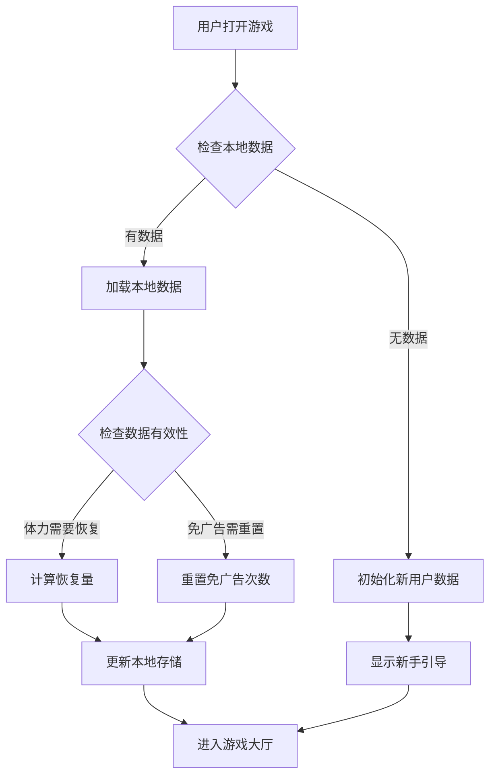
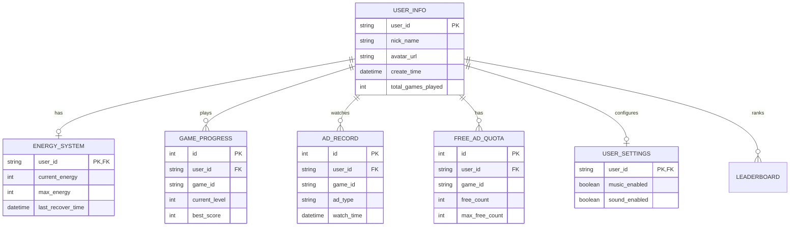

# 抖音小游戏大厅数据库设计

## 概述

本文档描述了抖音小游戏大厅的数据库表结构设计，包括用户信息、体力系统、游戏进度、广告记录等核心数据表。

## 技术选型

由于抖音小游戏运行在客户端，我们采用以下数据存储方案：

1. **本地存储**: 使用 `tt.setStorageSync` / `tt.getStorageSync` 存储用户数据
2. **云开发**: 可选接入抖音云开发，使用云数据库进行数据同步
3. **后端API**: 如需完整后端支持，可搭建独立服务器

## 数据表设计

### 1. 用户信息表 (user_info)

存储用户的基本信息和游戏统计数据。

```sql
CREATE TABLE user_info (
    user_id VARCHAR(64) PRIMARY KEY,      -- 用户唯一ID（抖音openid）
    nick_name VARCHAR(100),               -- 用户昵称
    avatar_url VARCHAR(500),              -- 头像URL
    gender TINYINT DEFAULT 0,             -- 性别 0-未知 1-男 2-女
    create_time DATETIME DEFAULT NOW(),   -- 注册时间
    last_login_time DATETIME,             -- 最后登录时间
    total_games_played INT DEFAULT 0,     -- 总游戏次数
    total_ads_watched INT DEFAULT 0,      -- 总广告观看次数
    vip_expire_time DATETIME,             -- VIP过期时间
    is_new_user BOOLEAN DEFAULT TRUE      -- 是否新用户
);
```

### 2. 体力系统表 (energy_system)

存储用户体力值和恢复信息。

```sql
CREATE TABLE energy_system (
    user_id VARCHAR(64) PRIMARY KEY,      -- 用户ID
    current_energy INT DEFAULT 200,       -- 当前体力值
    max_energy INT DEFAULT 200,           -- 最大体力值
    last_recover_time DATETIME,           -- 上次恢复时间
    recover_interval INT DEFAULT 300,     -- 恢复间隔（秒）
    recover_amount INT DEFAULT 1,         -- 每次恢复量
    energy_cap_time DATETIME,             -- 体力满额时间（用于推送）
    FOREIGN KEY (user_id) REFERENCES user_info(user_id)
);
```

### 3. 游戏进度表 (game_progress)

存储各小游戏的闯关进度和最高分。

```sql
CREATE TABLE game_progress (
    id INT AUTO_INCREMENT PRIMARY KEY,
    user_id VARCHAR(64),                  -- 用户ID
    game_id VARCHAR(50),                  -- 游戏ID (fangkuai, jiantou, etc.)
    current_level INT DEFAULT 1,          -- 当前关卡
    max_level INT DEFAULT 1,              -- 最高通关关卡
    best_score INT DEFAULT 0,             -- 最高分
    total_play_time INT DEFAULT 0,        -- 总游戏时长（秒）
    play_count INT DEFAULT 0,             -- 游戏次数
    last_play_time DATETIME,              -- 最后游戏时间
    level_data JSON,                      -- 关卡解锁状态JSON
    UNIQUE KEY uk_user_game (user_id, game_id),
    FOREIGN KEY (user_id) REFERENCES user_info(user_id)
);
```

### 4. 广告记录表 (ad_record)

记录用户观看广告的历史和免广告次数。

```sql
CREATE TABLE ad_record (
    id INT AUTO_INCREMENT PRIMARY KEY,
    user_id VARCHAR(64),                  -- 用户ID
    game_id VARCHAR(50),                  -- 游戏ID
    ad_type VARCHAR(20),                  -- 广告类型 (video/free/energy)
    watch_time DATETIME DEFAULT NOW(),    -- 观看时间
    ad_unit_id VARCHAR(100),              -- 广告位ID
    reward_type VARCHAR(20),              -- 奖励类型 (continue/energy/vip)
    reward_amount INT DEFAULT 1,          -- 奖励数量
    is_completed BOOLEAN DEFAULT TRUE,    -- 是否完整观看
    FOREIGN KEY (user_id) REFERENCES user_info(user_id)
);
```

### 5. 免广告次数表 (free_ad_quota)

记录每个游戏的免广告次数。

```sql
CREATE TABLE free_ad_quota (
    id INT AUTO_INCREMENT PRIMARY KEY,
    user_id VARCHAR(64),                  -- 用户ID
    game_id VARCHAR(50),                  -- 游戏ID
    free_count INT DEFAULT 0,             -- 已使用免广告次数
    max_free_count INT DEFAULT 2,         -- 最大免广告次数
    reset_date DATE,                      -- 重置日期
    UNIQUE KEY uk_user_game (user_id, game_id),
    FOREIGN KEY (user_id) REFERENCES user_info(user_id)
);
```

### 6. 排行榜表 (leaderboard)

存储各游戏的排行榜数据。

```sql
CREATE TABLE leaderboard (
    id INT AUTO_INCREMENT PRIMARY KEY,
    user_id VARCHAR(64),                  -- 用户ID
    game_id VARCHAR(50),                  -- 游戏ID
    score INT DEFAULT 0,                  -- 分数
    level INT DEFAULT 1,                  -- 关卡
    rank_date DATE,                       -- 排名日期
    rank_type VARCHAR(20) DEFAULT 'daily',-- 排名类型 (daily/weekly/all)
    UNIQUE KEY uk_user_game_date (user_id, game_id, rank_date, rank_type),
    FOREIGN KEY (user_id) REFERENCES user_info(user_id)
);
```

### 7. 设置表 (user_settings)

存储用户的游戏设置。

```sql
CREATE TABLE user_settings (
    user_id VARCHAR(64) PRIMARY KEY,
    music_enabled BOOLEAN DEFAULT TRUE,   -- 音乐开关
    sound_enabled BOOLEAN DEFAULT TRUE,   -- 音效开关
    vibration_enabled BOOLEAN DEFAULT TRUE,-- 震动开关
    notification_enabled BOOLEAN DEFAULT TRUE, -- 通知开关
    language VARCHAR(10) DEFAULT 'zh-CN', -- 语言设置
    FOREIGN KEY (user_id) REFERENCES user_info(user_id)
);
```

## 本地存储方案（抖音小游戏）

由于抖音小游戏主要使用本地存储，以下是localStorage的数据结构设计：

```javascript
// localStorage 数据结构

// 用户信息
{
  "userInfo": {
    "userId": "tt_xxx_openid",
    "nickName": "玩家昵称",
    "avatarUrl": "https://...",
    "createTime": 1234567890,
    "lastLoginTime": 1234567890
  }
}

// 体力系统
{
  "energy": {
    "current": 200,
    "max": 200,
    "lastRecoverTime": 1234567890,
    "recoverInterval": 300,
    "recoverAmount": 1
  }
}

// 游戏进度
{
  "gameProgress": {
    "fangkuai": {
      "currentLevel": 5,
      "maxLevel": 10,
      "bestScore": 1500,
      "playCount": 20,
      "lastPlayTime": 1234567890
    },
    "jiantou": {
      "currentLevel": 3,
      "maxLevel": 8,
      "bestScore": 800,
      "playCount": 15,
      "lastPlayTime": 1234567890
    }
    // ... 其他游戏
  }
}

// 免广告次数
{
  "freeAdQuota": {
    "jiantou": {
      "freeCount": 1,
      "maxFreeCount": 2,
      "resetDate": "2024-01-15"
    },
    "linghun": {
      "freeCount": 0,
      "maxFreeCount": 2,
      "resetDate": "2024-01-15"
    }
    // ... 其他游戏
  }
}

// 广告记录
{
  "adRecords": [
    {
      "gameId": "fangkuai",
      "adType": "video",
      "watchTime": 1234567890,
      "rewardType": "continue",
      "isCompleted": true
    }
  ]
}

// 用户设置
{
  "settings": {
    "musicEnabled": true,
    "soundEnabled": true,
    "vibrationEnabled": true,
    "notificationEnabled": true
  }
}
```

## 数据同步策略



## 体力恢复算法

```javascript
// 体力恢复计算
function calculateEnergyRecovery(energyData) {
  const now = Date.now();
  const lastRecover = energyData.lastRecoverTime;
  const interval = energyData.recoverInterval * 1000; // 转为毫秒
  const elapsed = now - lastRecover;
  
  // 计算恢复次数
  const recoverTimes = Math.floor(elapsed / interval);
  
  if (recoverTimes > 0) {
    const recoverAmount = recoverTimes * energyData.recoverAmount;
    const newEnergy = Math.min(
      energyData.current + recoverAmount,
      energyData.max
    );
    
    return {
      current: newEnergy,
      lastRecoverTime: lastRecover + recoverTimes * interval,
      recovered: recoverAmount
    };
  }
  
  return {
    current: energyData.current,
    lastRecoverTime: energyData.lastRecoverTime,
    recovered: 0
  };
}
```

## 免广告次数重置逻辑

```javascript
// 免广告次数重置
function checkAndResetFreeAdQuota(quotaData) {
  const today = new Date().toDateString();
  
  if (quotaData.resetDate !== today) {
    return {
      freeCount: 0,
      maxFreeCount: quotaData.maxFreeCount,
      resetDate: today
    };
  }
  
  return quotaData;
}
```

## 数据表关系图



## 初始化数据脚本

```javascript
// 新用户初始化数据
function initNewUserData(openid) {
  const userData = {
    userInfo: {
      userId: openid,
      nickName: '新玩家',
      avatarUrl: '',
      createTime: Date.now(),
      lastLoginTime: Date.now()
    },
    energy: {
      current: 200,
      max: 200,
      lastRecoverTime: Date.now(),
      recoverInterval: 300,
      recoverAmount: 1
    },
    gameProgress: {},
    freeAdQuota: {},
    adRecords: [],
    settings: {
      musicEnabled: true,
      soundEnabled: true,
      vibrationEnabled: true,
      notificationEnabled: true
    }
  };
  
  // 初始化各游戏进度
  GAMES_CONFIG.forEach(game => {
    userData.gameProgress[game.id] = {
      currentLevel: 1,
      maxLevel: 1,
      bestScore: 0,
      playCount: 0,
      lastPlayTime: null
    };
    
    // 初始化免广告次数
    if (game.adType === 'free' || game.adType === 'video') {
      userData.freeAdQuota[game.id] = {
        freeCount: 0,
        maxFreeCount: 2,
        resetDate: new Date().toDateString()
      };
    }
  });
  
  return userData;
}
```
