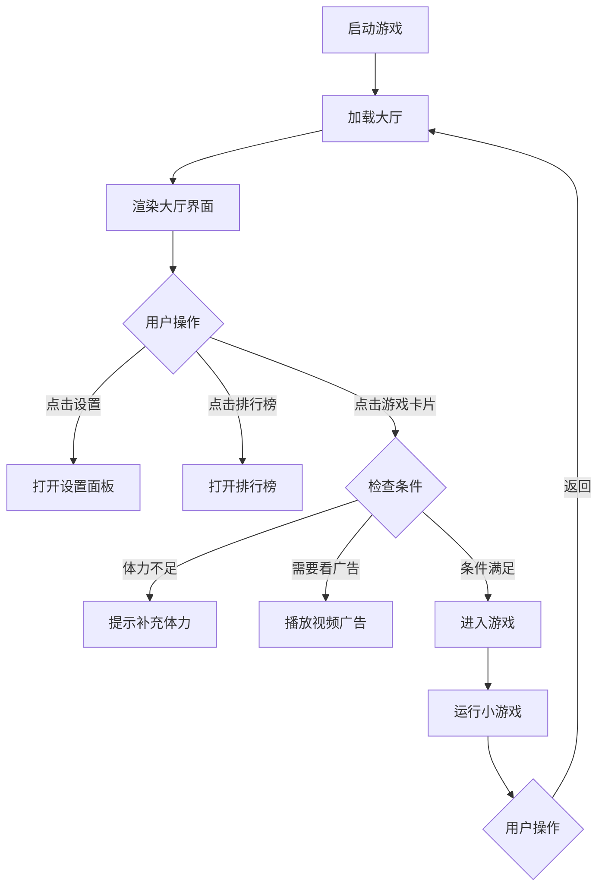

# 抖音小游戏大厅架构设计

## 项目概述

基于抖音小游戏平台，开发一个游戏大厅应用，包含多个小游戏入口。用户可以浏览游戏列表，点击卡片进入对应的小游戏。

## 系统架构

### 目录结构

```
byglg/
├── game.js                 # 游戏大厅主入口
── game.json               # 游戏配置
├── project.config.json     # 项目配置
├── icon.png                # 应用图标
├── images/                 # 图片资源目录
│   ├── hall-bg.png         # 大厅背景图
│   ├── games/              # 游戏图标
│   │   ├── fangkuai.png    # 方块消消乐图标
│   │   ├── jiantou.png     # 箭头消消消图标
│   │   ├── linghun.png     # 灵魂碎片图标
│   │   ├── duomaomao.png   # 躲猫猫图标
│   │   ├── eluosi.png      # 俄罗斯方块图标
│   │   ├── lianliankan.png # 连连看图标
│   │   ├── tingche.png     # 停车出库图标
│   │   ├── pintu.png       # 拼图游戏图标
│   │   ── fanhui.png      # 图返原图标
│   └── ui/                 # UI元素
│       ├── setting.png     # 设置图标
│       ├── rank.png        # 排行榜图标
│       ├── energy.png      # 体力图标
│       └── ad-icon.png     # 广告标识图标
├── js/                     # JavaScript模块目录
│   ├── hall.js             # 大厅主逻辑
│   ├── game-card.js        # 游戏卡片组件
│   ├── top-bar.js          # 顶部状态栏
│   ├── router.js           # 路由管理
│   └── ad-manager.js       # 广告管理
└── games/                  # 各小游戏模块
    ├── fangkuai/           # 方块消消乐
    │   └── index.js
    ├── jiantou/            # 箭头消消消
    │   └── index.js
    ├── linghun/            # 灵魂碎片
    │   └── index.js
    ├── duomaomao/          # 躲猫猫
    │   └── index.js
    ├── eluosi/             # 俄罗斯方块
    │   ── index.js
    ├── lianliankan/        # 连连看
    │   └── index.js
    ├── tingche/            # 停车出库
    │   └── index.js
    ├── pintu/              # 拼图游戏
    │   └── index.js
    └── fanhui/             # 图返原
        └── index.js
```

## 核心模块设计

### 1. 游戏大厅主模块 (hall.js)

负责大厅的整体渲染和交互逻辑。

```javascript
// hall.js 主要功能
class GameHall {
  constructor() {
    this.canvas = tt.createCanvas();
    this.ctx = this.canvas.getContext('2d');
    this.games = [];          // 游戏列表
    this.topBar = null;       // 顶部状态栏
    this.gameCards = [];      // 游戏卡片列表
    this.currentScene = 'hall'; // 当前场景
  }
  
  init() {
    // 初始化画布
    // 加载游戏列表
    // 渲染大厅界面
  }
  
  render() {
    // 绘制背景
    // 绘制顶部状态栏
    // 绘制游戏卡片列表
  }
  
  handleTouch(touch) {
    // 处理触摸事件
    // 判断点击位置，触发对应操作
  }
}
```

### 2. 游戏卡片组件 (game-card.js)

每个游戏卡片的渲染和交互。

```javascript
// game-card.js
class GameCard {
  constructor(config) {
    this.id = config.id;           // 游戏ID
    this.name = config.name;       // 游戏名称
    this.icon = config.icon;       // 图标路径
    this.adType = config.adType;   // 广告类型 (video/free/ad-free)
    this.adCount = config.adCount; // 广告观看次数 (0/2)
    this.x = 0;                    // 卡片X坐标
    this.y = 0;                    // 卡片Y坐标
    this.width = 0;                // 卡片宽度
    this.height = 0;               // 卡片高度
  }
  
  render(ctx) {
    // 绘制卡片背景
    // 绘制游戏图标
    // 绘制游戏名称
    // 绘制广告标识
  }
  
  contains(x, y) {
    // 判断坐标是否在卡片范围内
  }
}
```

### 3. 顶部状态栏 (top-bar.js)

显示设置、排行榜、体力值等信息。

```javascript
// top-bar.js
class TopBar {
  constructor() {
    this.energy = { current: 200, max: 200 };  // 体力值
    this.energyTimer = '02:44';                 // 体力恢复倒计时
    this.buttons = [
      { id: 'setting', icon: 'setting.png', text: '设置' },
      { id: 'rank', icon: 'rank.png', text: '方块排行榜' }
    ];
  }
  
  render(ctx) {
    // 绘制设置按钮
    // 绘制排行榜按钮
    // 绘制体力值显示
    // 绘制右上角用户信息
  }
}
```

### 4. 路由管理 (router.js)

管理场景切换和游戏跳转。

```javascript
// router.js
class Router {
  constructor() {
    this.scenes = {
      'hall': null,      // 大厅场景
      'fangkuai': null,  // 方块消消乐
      'jiantou': null,   // 箭头消消消
      'linghun': null,   // 灵魂碎片
      'duomaomao': null, // 躲猫猫
      'eluosi': null,    // 俄罗斯方块
      'lianliankan': null, // 连连看
      'tingche': null,   // 停车出库
      'pintu': null,     // 拼图游戏
      'fanhui': null     // 图返原
    };
    this.currentScene = 'hall';
  }
  
  navigateTo(sceneId) {
    // 切换到指定场景
    // 加载对应游戏模块
  }
  
  goBack() {
    // 返回大厅
  }
}
```

### 5. 广告管理 (ad-manager.js)

管理视频广告和免广告逻辑。

```javascript
// ad-manager.js
class AdManager {
  constructor() {
    this.videoAd = null;  // 视频广告实例
  }
  
  init() {
    // 初始化视频广告
    if (tt.createRewardedVideoAd) {
      this.videoAd = tt.createRewardedVideoAd({ adUnitId: 'xxx' });
    }
  }
  
  showAd(gameId, callback) {
    // 显示视频广告
    // 广告完成后执行callback
  }
  
  checkFreeAd(gameId) {
    // 检查是否已观看免广告次数
  }
}
```

## 游戏列表配置

```javascript
const GAMES_CONFIG = [
  {
    id: 'fangkuai',
    name: '方块消消乐',
    icon: 'images/games/fangkuai.png',
    adType: 'energy',      // 消耗体力
    energyCost: 5
  },
  {
    id: 'jiantou',
    name: '箭头消消消',
    icon: 'images/games/jiantou.png',
    adType: 'free',        // 免广告
    adCount: { current: 0, max: 2 }
  },
  {
    id: 'linghun',
    name: '灵魂碎片',
    icon: 'images/games/linghun.png',
    adType: 'video',
    adCount: { current: 0, max: 2 }
  },
  {
    id: 'duomaomao',
    name: '躲猫猫',
    icon: 'images/games/duomaomao.png',
    adType: 'video',
    adCount: { current: 0, max: 2 },
    hasSideBar: true       // 侧边栏标识
  },
  {
    id: 'eluosi',
    name: '俄罗斯方块',
    icon: 'images/games/eluosi.png',
    adType: 'video',
    adCount: { current: 0, max: 2 }
  },
  {
    id: 'lianliankan',
    name: '连连看',
    icon: 'images/games/lianliankan.png',
    adType: 'video',
    adCount: { current: 0, max: 2 }
  },
  {
    id: 'tingche',
    name: '停车出库',
    icon: 'images/games/tingche.png',
    adType: 'video',
    adCount: { current: 0, max: 2 }
  },
  {
    id: 'pintu',
    name: '拼图游戏',
    icon: 'images/games/pintu.png',
    adType: 'video',
    adCount: { current: 0, max: 2 }
  },
  {
    id: 'fanhui',
    name: '图返原',
    icon: 'images/games/fanhui.png',
    adType: 'video',
    adCount: { current: 0, max: 2 },
    description: '据说只有1%的人能把图返回'
  }
];
```

## UI布局设计

### 大厅布局

```
─────────────────────────────────────┐
│  [设置] [排行榜]          [用户] [...] │  <- 顶部状态栏 (80px)
│  ⚡ 200/200+                        │
│  02:44                              │
├─────────────────────────────────────┤
│                                     │
│  ┌──────────┐  ┌──────────        │
│  │ 游戏图标  │  │ 游戏图标  │        │  <- 游戏卡片行1
│  │          │  │          │        │
│  │ 方块消消乐│  │ 箭头消消消│        │
│  └──────────┘  ──────────┘        │
│                                     │
│  ┌──────────┐  ┌──────────┐        │
│  │ 游戏图标  │  │ 游戏图标  │        │  <- 游戏卡片行2
│  │          │  │          │        │
│  │ 灵魂碎片  │  │ 躲猫猫   │        │
│  └──────────┘  └──────────┘        │
│                                     │
│  ┌──────────┐  ┌──────────┐        │
│  │ 游戏图标  │  │ 游戏图标  │        │  <- 游戏卡片行3
│  │          │  │          │        │
│  │ 俄罗斯方块│  │ 连连看   │        │
│  └──────────┘  └──────────┘        │
│                                     │
│  ┌──────────┐  ┌──────────        │
│  │ 游戏图标  │  │ 游戏图标  │        │  <- 游戏卡片行4
│  │          │  │          │        │
│  │ 停车出库  │  │ 拼图游戏 │        │
│  └──────────┘  └──────────┘        │
│                                     │
│  ──────────┐                      │
│  │ 游戏图标  │                      │  <- 游戏卡片行5
│  │          │                      │
│  │ 图返原   │                      │
│  └──────────┘                      │
│                                     │
└─────────────────────────────────────┘
```

### 卡片尺寸

- 卡片宽度: (屏幕宽度 - 3 * 间距) / 2
- 卡片高度: 卡片宽度 * 1.2
- 卡片间距: 15px
- 卡片圆角: 12px

## 交互流程



## 技术要点

1. **Canvas渲染**: 使用抖音小游戏Canvas API进行2D渲染
2. **触摸事件**: 监听touchstart/touchmove/touchend事件处理交互
3. **资源管理**: 预加载图片资源，使用缓存避免重复加载
4. **广告接入**: 使用抖音激励视频广告API
5. **数据存储**: 使用tt.setStorageSync/tt.getStorageSync保存用户数据

## 后续扩展

- 添加更多小游戏
- 实现用户登录和排行榜功能
- 添加音效和背景音乐
- 实现游戏内购功能
